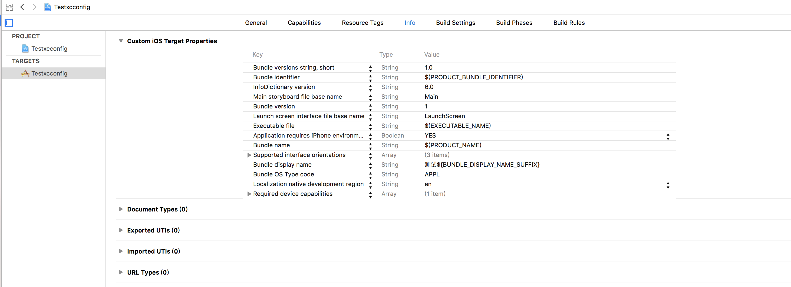

#Xcode 相关概念
去年的时候有翻译过一篇关于同时在手机上面安装几个版本(Debug,Release,AppStore等)的[文章](http://joakimliu.github.io/2015/07/01/Translate-The-Blog-Post-Concurrent-Debug-Beta-and-App-Store-Builds/)，后面一直都没有实际操作过项目配置相关的东西，最近同事在搞自动化打包相关的东西，又增加了几个版本。所以想巩固下 Xcode 中的相关概念，所以把官方文档[Xcode Concepts](https://developer.apple.com/library/content/featuredarticles/XcodeConcepts/Concept-Targets.html)看了一篇，顺便翻译总结一下。先总结下概念性的东西， 后面再弄个实例。

##Xcode Target
`A target specifies a product to build and contains the instructions for building the product from a set of files in a project or workspace. A target defines a single product; it organizes the inputs into the build system—the source files and instructions for processing those source files—required to build that product. Projects can contain one or more targets, each of which produces one product.`

一个 target 就代表构建一个产品所需要的相关指令，构建产品所需的一套文件资源来自于 project 或者 workspace(下面会提到)。简单来说，一个 target 就定义了一个产品，它组织源文件以及构建产品所需要的进程指令到构建系统中。 Projects 可以包含一个或者多个 target，它们代表不同的产品(例如：如果你的产品需要做企业版和 AppStore 版本，那么你可以考虑采取两个 target 来处理)。

构建产品的指令采取构建设置(build settings)和构建参数(build phases)的形式来设置，这些都可以在Xcode的 project editor 中调整。一个 target 继承 project 构建设置，但是你可以通过在不同的 target 层级指定不同的设置来重载任何的 project 设置。同时间内只能有一个 active target，Xcode scheme 能够指定 active target。

一个 target 可以跟其他 target 相关联。如果一个 target 在构建的时候需要另外一个 target 的输出，我们说前者依赖于后者。如果两个 target 在相同的 workspace 里，Xcode 能够发现它们的从属关系，它能够以需要的顺序构建产品(即首先构建后者，再构建前者)。这样的关系可以被称为隐形从属依赖(implicit dependency)。当然你也可以在 build settings 
中指定它们的显性从属依赖(explicit dependency)，当你需要连接到不在同个 workspace 的 library 时，因为这个时候 Xcode 没法发现它们的依赖关系。


##Xcode Project
`An Xcode project is a repository for all the files, resources, and information required to build one or more software products. A project contains all the elements used to build your products and maintains the relationships between those elements. It contains one or more targets, which specify how to build products. A project defines default build settings for all the targets in the project (each target can also specify its own build settings, which override the project build settings).`

Xcode project 是个构建一个或者多个产品所需要的文件，资源，信息等的仓库。project 包含用于构建你产品的所有元素，并且管理这些元素间的关系。它包含一个或多个 target，指定怎样去构建产品。A project 在工程里面默认的为所有的 target 指定 build settings（每个 target 可以覆盖 project build settings，去指定自己特有的 build settings）。

一个 Xcode project 包含下面的信息：
* 源文件的引用：
  * 源码，包括头文件和实现文件
  * Libraries and frameworks, internal and external
  * 资源文件(plist等)
  * 图片文件
  * nib 文件(xib,故事版等)
* 采取分组的形式在工程结构导航中组织源文件(这里又分物理文件和引用文件)
* Project-level build configurations. 你可以为 project 指定多个 build configuration，例如，Xcode 就默认为我们指定了 debug 和 release 的 build settings，当然你也可以自定义个 AppStore build setting。
* Targets，每个 target 指定(前面 Xcode Target 已有提到)：
  * project 构建的一个 product 的引用
  * 构建 product 所需的资源文件的引用
  * build configuration 可以用于构建 product，包括和其他 targets 的附属依赖关系以及其他设置；project-level build settings 当 target's build configurations 没有覆盖它们的时候是可用的。
* 执行环境(executable environment)，debug 还是 test，每个执行环境指定：
  * 当你运行或者调试的时候，哪个可执行文件启动
  * 如果有的话，Command-line 参数传递给可执行文件
  * 如果有的话，当运行程序的时候，每一个环境变量都会被设置

A project 可以单独存在，也可以被包含在 workspace 里面(cocoapods 就是被包含在 workspace 里面)。

`You use Xcode schemes to specify which target, build configuration, and executable configuration is active at a given time.`
你用 Xcode scheme 去指定哪个 target，编译配置，可执行配置 在规定的时间(即运行的时候)是有效的。


##Build Settings
`A build setting is a variable that contains information about how a particular aspect of a product’s build process should be performed. For example, the information in a build setting can specify which options Xcode passes to the compiler.`

A build setting 是一个包含产品构建过程中指定某个特定方面需要被执行等相关信息的变量。例如，这个信息在传递给编译器的时候能够在 Xcode build setting 被指定。

你能够在 project 或者 target 层级指定 build settings。每个 project-level 的 build setting 都添加到 project 中的所有 target 里面，除非被某个特定 target 的 build setting 重载。（意思是，如果 target 中已经指定了相同的设置，那么 project 层级的就不会被添加，有点子类父类继承的概念。）

在 Xcode 中的 build setting 有两部分：title 和 definition。title 能够定义 build setting，能被其他设置使用。definition 是一个 Xcode 的常量或准则去决定在构建的时候使用哪个值。A build setting 可能会有一个 display name，用于在 Xcode 用户界面展示。

除了使用 project template 创建新工程被 Xcode 提供的默认构建设置以外，你可以为你的 project 或者特定的一个 target 创建 user-defined build setting。你还可以指定条件构建设置，条件构建设置的值取决于哪个先决条件是满足的。这种机制允许你，例如，指定 SDK 在一个特定的架构上面构建一个产品。


##Xcode Workspace
`A workspace is an Xcode document that groups projects and other documents so you can work on them together. A workspace can contain any number of Xcode projects, plus any other files you want to include. In addition to organizing all the files in each Xcode project, a workspace provides implicit and explicit relationships among the included projects and their targets.`

workspace 是一种 Xcode 文档，它组织 projects 和其他文档，这样你就可以在它们上面一起工作。一个 workspace 可以包含任何数量的 Xcode projects，添加其他你想要添加的其他文件。除了组织每个 Xcode project 中的所有文件外，workplace 还提供了包括 project 和它们的 targets 之间隐性和显性的关系。

###Workspaces Extend the Scope of Your Workflow
一个 project 文件包含指向工程中的所有文件，以及构建配置和其他工程信息。在 Xcode4 及以后，你可以选择创建一个 workspace 去管理一个或者多个 project ，添加其他你想要添加的文件。一个 project 可以属于多个 workspace。


###Projects in a Workspace Share a Build Directory
默认情况下，workspace 下面的 projects 都是在同一个目录下构建的，也就是 workspace 的编译目录(workspace build directory)。由于是在同一个目录下面，project 的资源文件都彼此都是可见的，可互相引用的。所以，如果你有多个 projects 使用相同库的时候，不需要将它分别拷贝到各个 project 中。

Xcode 会在编译目录下检查文件发现它们的隐形从属依赖。例如，如果 workspace 中的一个 project 编译的时候需要链接到相同 workspace 的其他 project 某个库，Xcode 会自动帮你先编译那个库，即使构建配置没有显式的指定从属依赖关系。如果需要的话，你可以指定显式从属依赖，但是你必须创建 project 引用。

workspace 中的每个 project 仍然有属于它们自己的独立的标识。你也可以单独打开某个 project 而没有必要打开 workspace，或者你也可以添加某个 project 到其他的 workspace。因为，一个 project 可以属于多个 workspace，你可以任意组合 projects，而无需重新配置 projects 或者 workspaces。


##Xcode Scheme
`An Xcode scheme defines a collection of targets to build, a configuration to use when building, and a collection of tests to execute.`

Xcode scheme 定义了构建的很多 targets，构建时的配置，以及需要执行的测试等。

你可以有多个你想要的 scheme，但是只有一个是有效的。我们可以指定一个 scheme 保存在 project(在 project 所属的 workspace 中也是有效的) 还是 workspace(只有当前 workspace 是有效的) 中。当你选择了 scheme 以后，也就意味着你选择了运行的目的（即哪个产品去构建）。

##总结
 * 一个 target 代表一个产品
 * project 包含了构建产品所需的源文件，一个 project 可以有多个 target
 * build settings 就是构建产品时的一些设置，target 可以覆盖 project 一些相同的设置
 * workspace 是一种 Xcode文档，用来组织管理 project 和其他文档的，workspace 可以包含多个 project，project 可以属于多个 workspace
 * scheme 决定了哪个 target 去运行，它可以针对编译，运行，测试，打包等进行配置

###参考链接
[Xcode workspace project target scheme](http://stackoverflow.com/questions/20637435/xcode-what-is-a-target-and-scheme-in-plain-language)


#实践
##环境分离
###使用多 target 进行环境分离
首先创建一个 XcodeConcepts 的工程，其实 Xcode 已经默认为我们做了 Debug 和 Release 的配置。


打开 scheme，在 run 选项中，我们可以选择 Build Configuration，Executable 等设置(在 Edit Scheme -> Run)。


嗯，现在来创建一个 target，


在弹出来的选择框中选择 "Duplicate Only"，这样就创建好了，现在在 scheme manage 里面我们就能看的可以选择哪个 target 去运行了。


当然，你可以觉得 Xcode 默认为我们生成 copy 名字不好听，你也可以改名字，在 scheme manage 里面，选择要改的 Scheme，按回车输入新名字，当然你也可以在 Targets 里面、相关 plist 文件也修改成相应的名字。注意，plist 文件改名成功后，我们还得改变它的物理路径，改完以后，再添加进入工程中，这时你选中 XcodeConceptsTest -> Info 时，它报`Information from info.plist not available.File may not exist at specfiied path.` 这时，你应该在该 target 中的 Build Settings -> Packaging -> Info.plist File 设置中设置值为 `$(SRCROOT)/XcodeConcepts/XcodeConceptsTest.plist`。 $(SRCROOT) 就是代表你当前工程目录的根目录，即 xxxx/XcodeConcepts。

问题：为什么创建的 Xcode 工程中 Info.plist 文件中的右侧的 Target Membership 是没有勾选的，所以我加入 XcodeConceptsTest.plist 的时候也没有选择任何 target，只要在 Packaging -> Info.plist File 指定路径后，Xcode 会自动帮我们处理的。但是，我们创建文件的时候，就得需要勾选两个 target 的了，不然编译没有添加的那个时会报错的，找不到该资源文件。


如果想要在手机上面同时展示这两个 App 的话，我们得设置它们为不同的 Bundle Identifier，Targets -> General -> Bundle Identifier 中调整。

为了方便展示，我将 target 的名字($(PRODUCT_NAME))改成 one 和 two，在各个 Targets -> Info -> Bundle name。但是会运行失败，Xcode 报错：

`The operation couldn’t be completed. (LaunchServicesError error 0.)`

我们将 Xcode clean 一下，再重新运行就好了。


那么如何在代码里面辨别是哪个 target 呢，我们可以用 `[[NSBundle mainBundle] bundleIdentifier]` bundleIdentifier 字符串来判断，我们也可以用预处理宏来处理，选择 target -> Build Settings -> Preprocessor Macros，将宏改成 TEST。


这样，就可以用宏来判断了。

```
    NSString *identifier = [[NSBundle mainBundle] bundleIdentifier];
    NSDictionary *dict = [[NSProcessInfo processInfo] environment];
    NSLog(@"environment :%@",dict);
#ifdef TEST
    NSLog(@"test environment:%@",identifier);
#else
    NSLog(@"normal environment:%@",identifier);
#endif
```

其实还可以分环境来指定，例如，在 XcodeConcepts target 里面的 Preprocessor Macros 中 Debug 加入 TEST=0，在 XcodeConceptsTest 相应位置加入 TEST=1，当然这个只是在 Debug 环境下有用咯。

当然你还可以在不同的 target 里面指定启动图片以及 icon 等。

####参考链接
 * [using-xcode-targets](http://www.appcoda.com/using-xcode-targets/)
 * [how to detect targets in project](http://stackoverflow.com/questions/6964630/xcode-project-how-to-detect-target-programatically-or-how-to-use-env-vars)
 * [why plist.file Target Membership is not check](http://stackoverflow.com/questions/3095612/warning-the-copy-bundle-resources-build-phase-contains-this-targets-info-plist)


###使用多 xcconfig 进行环境分离
简单来说，就是在 Project -> Info -> Configurations，duplicate XXX build configuration，针对不同的 configuration 配置不同的 xcconfig 文件，然后在不同的 xcconfig 里面，配置 Product Bundle Identifier、SeverURL、xxxKey等等。然后 New Scheme，创建相对的 xcconfig scheme，根据不同的 scheme 配置不同的 Build Configuration，依次选中 scheme，在 Edit scheme -> Run 中，配置 Build Configuration 即可。

下面来一波图~

工程创建好后，Xcode 默认会为我们创建 Debug、Release 两个 Configurations.


我们自己也可以创建 xxconfig 文件，New file -> Other -> Configuration Settings File. 


命名为 Debug.xcconfig。这时，你就能在 Configurations 看到 Debug 选项了。注意，Xcode 默认创建后是没有选项的，只有 None。


然后我们再创建 Release.xcconfig(预发布版本配置文件)，UAT_α.xcconfig(UAT 测试版本配置文件)，Generator.xcconfig(这个文件没有对应版本，后面再说)，然后在各个版本对应的配置文件里面写相对应的值，这里我们只举例服务端请求地址。


再到 Configurations 里面，创建 UAT_α 对应的 Configuration，并且选择好各个 Configuration 的值。


然后为 UAT_α,Release 分别创建一个 scheme，New Scheme，命名为 UAT_α,Release。


然后为每个 scheme 配置好相应的 Configuration，Edit Scheme。

Scheme       | Configuration
-------------|-------------
Testxcconfig | Debug  
UAT_α        | UAT_α  
Release      | Release  
  


好了，分环境的变量已经设置好了，现在让它在手机上面同时存在，那么我们就得改变它的 Bundle identifier。默认的就是 $(PRODUCT_BUNDLE_IDENTIFIER)。


在 Targets -> Build Settings -> Product Bundle Identifier，为不同的 scheme 设置不同的 Bundle identifier。


再来改变它的显示名字 Bundle display name，这个 key 在 plist 文件里面是没有的，我们可以创建一个。命名为`测试${BUNDLE_DISPLAY_NAME_SUFFIX}`。在刚刚创建的那三个 xxconfig 文件里面，定义它们的值。例如，在 Debug.xxconfig 里面为 `BUNDLE_DISPLAY_NAME_SUFFIX = @"1"`。


选择每个 scheme，依次运行在模拟器上。


当然也可以手动创建 Editor -> Add Build Setting -> Add User-Defined Setting。命名为`BUNDLE_DISPLAY_NAME_SUFFIX2`。 


展开它，就会有三个选项让你填写，我们分别填写为简单的值，a,b,c。


我们将名字重新命名一下 `测试${BUNDLE_DISPLAY_NAME_SUFFIX}${BUNDLE_DISPLAY_NAME_SUFFIX2}`。


每个 scheme 再次运行到模拟器上


其实，我们也可以设置不同的 Icon，在 Targets -> Build Setting -> Asset Catalog App Icon Set Name，这里就不举例一一验证了。

上面提到的 Generator.xcconfig 只是一个普通的文件，你也可以命名为 Generator1.xcconfig。它的作用就是将每个 xcconfig 文件都用到的东西提取出来，我们可以将 `#include "Generator.xcconfig"` 注释掉，然后将 `GCC_PREPROCESSOR_DEFINITIONS = $(inherited) SeverURL='$(SeverURL)'` 在每个 xcconfig 文件里面都写一次。 那现在问题来了，为什么 xcconfig 文件里面的 BUNDLE_DISPLAY_NAME_SUFFIX 没有 GCC_PREPROCESSOR_DEFINITIONS。因为 GCC_PREPROCESSOR_DEFINITIONS(预编译头参数) 的作用就是将配置文件里面的常量预编译成宏，以便在代码里面用到。在 Build Settings -> Preprocessor Macros 可以看到。

那么 $(inherited) 又是什么呢？ inherited 是继承的意思嘛，而 $(),${} 都是预处理的语法，所以就可以理解为 target-level 继承 project-level 的一些配置。上面有提到过，target-level 可以重载 project-level 的一些配置。

还有很多的，我们可能见过，但是具体是什么却不是很懂，例如，$(SRCROOT)、$(PROJECT)等(ps，参考链接9有提到)。

####总结
其实，就是用 xcconfig 去修改 Build Settings 里面的相关值，它能根据不同的 Configuration 配置不同文件。我们要做的就是将 Build Settings 里面的一些选项在 xcconfig 里面用代码去调整设置。例如，直接用代码设置 SDKROOT、ONLY_ACTIVE_ARCH、GCC_SYMBOLS_PRIVATE_EXTERN、GCC_OPTIMIZATION_LEVEL等的值。(ps,参考链接12,13有提到)。

这里只是提到了 xcconfig 文件的冰山一角，如跟 cocoapods、SDK、xcodebuild 相关的东西，还是不懂。另外，pewpewthespells [twitter](https://twitter.com/queersorceress) 、[blog](http://pewpewthespells.com/)、[github](https://github.com/samdmarshall/managing-xcode-example) 有篇博文是讲 Xcode xcconfig(ps,参考链接14) 的，很全面，另外他还有写到相关管理 Xcode 的东西。

####参考链接
 * 1.[How to Have Two Versions of the Same App on Your Device](http://nilsou.com/blog/2013/07/29/how-to-have-two-versions-of-the-same-app-on-your-device/)
 * 2.[Xcode使用xcconfig文件配置环境](http://liumh.com/2016/05/22/use-xcconfig-config-specific-variable/)
 * 3.[xcode-configuration-files](https://speakerdeck.com/hasseg/xcode-configuration-files)
 * 4.[Libsyscall.xcconfig](http://opensource.apple.com/source/xnu/xnu-2422.1.72/libsyscall/Libsyscall.xcconfig)
 * 5.[Building from the Command Line with Xcode FAQ](https://developer.apple.com/library/content/technotes/tn2339/_index.html)
 * 6.[iOS多环境配置](http://www.jianshu.com/p/0f1e8dc0812a)
 * 7.[What is $(inherited) in Xcode's search path settings?](http://stackoverflow.com/questions/15343122/what-is-inherited-in-xcodes-search-path-settings)
 * 8.[xcode4的环境变量，Build Settings参数，workspace及联编设置](http://www.cnblogs.com/xiaodao/archive/2012/03/28/2422091.html)
 * 9.[Xcode Build Setting Reference](ftp://ftp.informatimago.com/pub/mirrors/developer.apple.com/documentation/DeveloperTools/Reference/XcodeBuildSettingRef/XcodeBuildSettingRef.pdf)
 * 10.[iOS开发必备 - 环境变量配置(Debug & Release)](http://blog.startry.com/2015/07/24/iOS_EnvWithXcconfig/)
 * 11.[xcconfigs](https://github.com/jspahrsummers/xcconfigs)
 * 12.[Generating Xcode Build Configuration Files with BuildSettingExtractor (xcodeproj → xcconfig)](http://jamesdempsey.net/2015/01/31/generating-xcode-build-configuration-files-with-buildsettingextractor-xcodeproj-to-xcconfig/)
 * 13.[Using xcconfig files for your XCode Project](http://www.jontolof.com/cocoa/using-xcconfig-files-for-you-xcode-project/)
 * 14.[The Unofficial Guide to xcconfig files](http://pewpewthespells.com/blog/xcconfig_guide.html)
 * 15.[Building the Build System - Part 1 - Abandoning the Build Panel](http://robnapier.net/build-system-1-build-panel)
